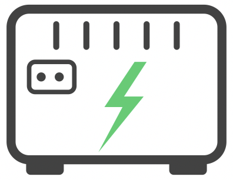

# Kohler GenStat

<div>


A complete home generator monitoring system: a Raspberry Pi reads real-time data from a Kohler transfer switch over RS-232 and publishes state changes to Supabase and Homebridge (HomeKit). A SwiftUI iPhone app displays the current status, runtime history, and event log, and dynamically changes its icon to reflect the generator state.

<br clear="both">
</div>

---

## Why This Exists

Residential standby generators run infrequently — typically a weekly exercise cycle and the occasional power outage. Between those events they sit idle, and most homeowners have no easy way to confirm the system is healthy without physically walking to the generator or the transfer switch panel to check the status LEDs.

This creates several blind spots:

- **Missed exercise cycles** — The Kohler RDT transfer switch has a known firmware issue where the weekly exercise schedule is cleared after a transfer event. Without visibility, the schedule may go unset for weeks or months without the homeowner knowing.
- **Silent failures** — If the generator fails to start during an outage, the homeowner may not know until they notice the lights are out. There is no built-in notification system.
- **No outage history** — The transfer switch has no accessible log. There is no way to know when the last outage occurred, how long it lasted, or how many hours the generator has accumulated.
- **Maintenance timing** — Generator manufacturers recommend service intervals based on runtime hours, but tracking those hours manually against a machine that runs for 20 minutes a week is impractical.

GenStat solves this by providing at-a-glance visibility into the operational state of the system. The monitoring service on the Raspberry Pi determines the current state from live voltage readings and publishes every state change to Supabase and Homebridge (HomeKit). The iOS app reads the Supabase database, presents the information in a clear, glanceable format, and dynamically changes its app icon to reflect the current generator state.

The system catches all four meaningful states:

| State | Meaning |
|---|---|
| **Normal** | Utility power present, generator idle — everything is fine |
| **Weekly Test** | Generator running its exercise cycle — both voltages present |
| **Outage** | Utility power lost, generator supplying the house |
| **Critical** | Utility power lost AND generator not running — immediate attention required |

---

## ⚠️ Safety Warning

> [!CAUTION]
> **The monitoring hardware requires physical access to the interior of an automatic transfer switch enclosure. This is extremely dangerous work that can result in severe injury or death.**
>
> An automatic transfer switch contains live mains voltage at all times — including on the utility input terminals — even when the generator is off and the circuit breakers inside the panel are open. The utility feed entering the enclosure from the top cannot be de-energized without disconnecting power at the utility meter. Contact with these terminals will cause severe injury or death.
>
> **All electrical work associated with this project must be performed by a licensed electrician.** If you are not a licensed electrician, do not open the transfer switch enclosure, do not route cables through it, and do not connect anything to the terminals or circuit boards inside.
>
> The software components of this project — the Python monitoring script, the iOS app, the Homebridge integration, and the Supabase backend — can all be developed and tested independently without touching the electrical hardware.

---

## Repository Structure

```
GenStat/                              ← repo root
├── README.md                         # This file — project overview
├── Secrets.xcconfig                  # Actual credentials — gitignored, never committed
├── Secrets.xcconfig.template         # Template for new developers — committed
├── GenStat.xcodeproj/
├── GenStat/                          # iOS app source (see GenStat/README.md)
│   ├── Models/
│   ├── Services/
│   ├── Views/
│   └── README.md
├── GenStatTests/                     # Swift Testing unit tests
└── monitoring/                       # Raspberry Pi monitoring service (see monitoring/README.md)
    ├── generator_monitor.py
    ├── install.sh
    ├── requirements.txt
    └── README.md
```

> **Note:** All paths shown above reflect the expected repository structure. Verify that actual paths on your Raspberry Pi deployment match before running the monitoring service or install script.

---

## Setup

### 1. Create your secrets file

Both the iOS app and the Python monitoring script read credentials from a single `Secrets.xcconfig` file in the project root. This file is gitignored and must be created manually on each machine.

```bash
cp Secrets.xcconfig.template Secrets.xcconfig
```

Edit `Secrets.xcconfig` and replace the placeholder values with your actual Supabase project URL and publishable API key:

```
SUPABASE_URL = https://your-project.supabase.co
SUPABASE_KEY = sb_publishable_...
```

> **Note:** `Secrets.xcconfig` must never be committed to the repository. It is listed in `.gitignore`. Each developer and each deployment (including the Raspberry Pi) must have its own copy.

### 2. Set up Supabase

Create a [Supabase](https://supabase.com) project and set up the two tables described in the [Database Schema](#database-schema) section below. Add Row Level Security policies allowing anonymous reads:

```sql
CREATE POLICY "Allow anonymous read" ON generator_status
    FOR SELECT TO anon USING (true);

CREATE POLICY "Allow anonymous read" ON generator_events
    FOR SELECT TO anon USING (true);
```

### 3. Component-specific setup

- **iOS app** — See [GenStat/README.md](GenStat/README.md) for Xcode build instructions
- **Monitoring service** — See [monitoring/README.md](monitoring/README.md) for Raspberry Pi deployment

---

## Database Schema

All monitoring data is stored in **Supabase** (hosted PostgreSQL with REST API). Two tables are used:

**`generator_status`** (single row, id = 1)

| Column | Type | Description |
|---|---|---|
| `id` | `int` | Always 1 |
| `updated_at` | `timestamptz` | Last backend update |
| `current_state` | `text` | One of: normal, weekly_test, outage, critical, unknown |
| `utility_voltage` | `float` | Mains voltage |
| `generator_voltage` | `float` | Generator output voltage |
| `generator_runtime_hours` | `float` | Lifetime runtime hours (outage only, excludes exercise) |
| `last_exercise_at` | `timestamptz` | Last completed exercise |
| `last_outage_at` | `timestamptz` | Most recent outage start |
| `last_outage_duration_seconds` | `int` | Most recent outage duration |

**`generator_events`** (append-only log)

| Column | Type | Description |
|---|---|---|
| `id` | `int` | Auto-incrementing primary key |
| `created_at` | `timestamptz` | When the event was recorded |
| `previous_state` | `text` | State before transition |
| `new_state` | `text` | State after transition |
| `utility_voltage` | `float` | Voltage at time of event |
| `generator_voltage` | `float` | Voltage at time of event |
| `duration_seconds` | `int` | How long the previous state lasted |

Both tables use Row Level Security with policies allowing anonymous read access (for the iOS app) and anon-role write access (for the monitoring service).

---

## HomeKit Integration

In addition to the Supabase backend, the monitoring service integrates with **Apple HomeKit** via [**Homebridge**](https://homebridge.io), allowing generator status to appear natively in the iOS Home app alongside other smart home devices.

### Infrastructure

Homebridge runs elsewhere in the home. The monitoring Pi and the Homebridge Pi communicate over the local network via simple HTTP calls — the monitoring Pi sends webhook requests to Homebridge whenever the generator state changes.

```
Monitoring Pi (basement)
    ↓ HTTP webhook (local network)
Homebridge Pi
    ↓ HomeKit protocol
iOS Home app
```

### HomeKit Accessories

The `homebridge-http-webhooks` plugin exposes two **occupancy sensors** in HomeKit:

| Accessory | Occupied when | Unoccupied when |
|---|---|---|
| **Generator Active** | Generator is running (weekly test or outage) | Generator is idle |
| **Utility Power** | Utility grid is present | Utility grid is down |

From these two binary sensors all four system states can be inferred:

| Generator Active | Utility Power | System State |
|---|---|---|
| Off | On | Normal |
| On | On | Weekly Test |
| On | Off | Outage |
| Off | Off | Critical |

### Homebridge Configuration

The relevant section of the Homebridge `config.json`:

```json
{
    "platform": "HttpWebHooks",
    "webhook_port": 51828,
    "cache_directory": "/var/lib/homebridge/.webhook-cache",
    "sensors": [
        {
            "id": "generator_active",
            "name": "Generator Active",
            "type": "occupancy"
        },
        {
            "id": "utility_power",
            "name": "Utility Power",
            "type": "occupancy"
        }
    ]
}
```

### Behavior During Network Outage

If the home network is unavailable (e.g. during a power outage where the network equipment is not on a generator-backed circuit), the HomeKit webhook calls will fail silently — the monitoring service logs the error and continues. When the network comes back up, the next state change will update the HomeKit sensors correctly. Supabase updates and the GenStat app follow the same pattern — they work when the network is available and catch up on the next successful connection.

---

## Next Steps

- **Push notifications** — Alert the homeowner immediately when the generator enters a critical state or when an outage begins/ends, rather than relying on foreground refresh
- **Widget / Live Activity** — An iOS widget or Live Activity showing current status on the Lock Screen and Home Screen
- **Historical charts** — Visualize runtime hours, outage frequency, and voltage trends over time using Swift Charts
- **Exercise schedule reminder** — Since the Kohler RDT clears the weekly exercise schedule after a transfer event, a future enhancement could surface a reminder in the app after an outage with a one-tap deep link to the transfer switch manual.
- **Multiple generators** — Support monitoring more than one generator from a single app instance
- **Localization** — Add string catalog entries for all user-facing text

---

## License

[Licensed under the MIT License](GenStat/LICENSE.md)

---

## Built With Claude

This project was developed collaboratively with [Claude](https://claude.ai), Anthropic's AI assistant, over several sessions in early 2026.

The collaboration followed a clear division of roles. The code — the Python monitoring service, the systemd configuration, the CadQuery enclosure script, the Homebridge webhook integration, the Supabase schema and RLS policies, and the GenStat iOS app specification — was written by Claude. Everything that shaped what got built was driven by the homeowner: defining the goals, asking the questions, providing hardware photographs and measurements, running commands on the Pi and reporting back the actual output, making design decisions when there were options, and pushing back when a proposed solution wasn't right.

The project started as a simple troubleshooting session for a Kohler generator that wouldn't start. Diagnosing a 7-year-old battery failure from fault codes led naturally to the question of ongoing visibility — and that question grew into the full monitoring system documented here. At each stage the homeowner decided what mattered, Claude figured out how to build it, and the back-and-forth between those two things is what produced the result.

It's a reasonable example of what human-AI collaboration looks like in practice: the human brings judgment, context, and real-world grounding; the AI brings breadth of knowledge and the ability to write and iterate on code quickly. Neither half works as well without the other.